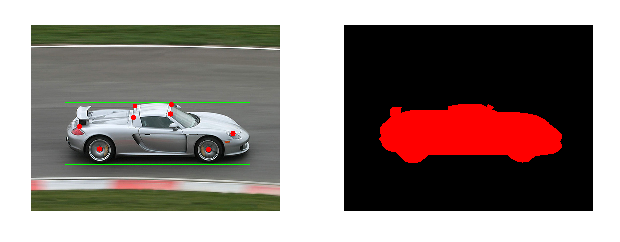
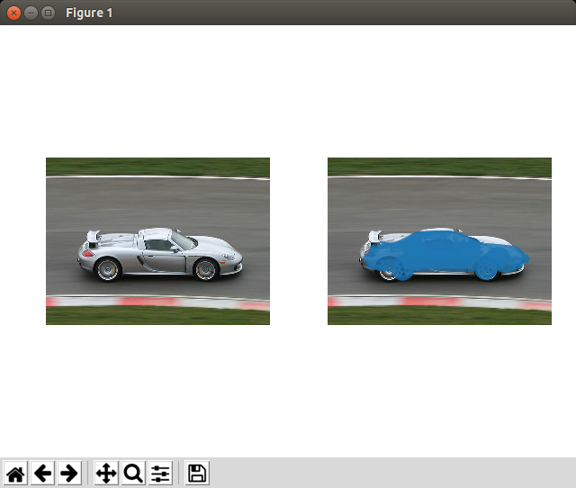
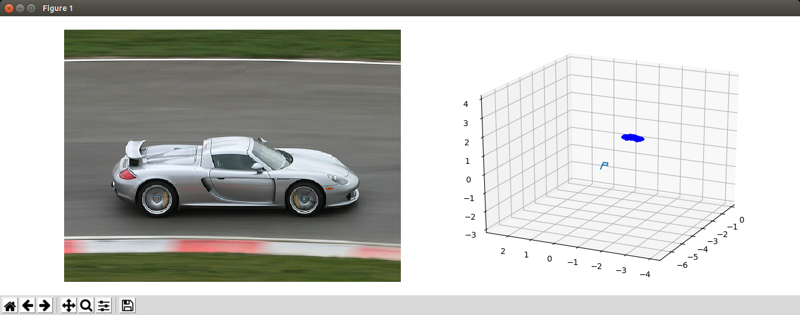
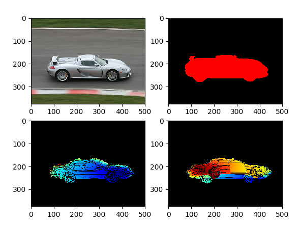

# pascal3d


Python version toolkit for [PASCAL3D](http://cvgl.stanford.edu/projects/pascal3d.html) dataset.  
(Matlab/Octave version is supported [in official](ftp://cs.stanford.edu/cs/cvgl/PASCAL3D+_release1.1.zip).)  


## Install

```bash
./install.sh
```


## Usage

```bash
cd examples/dataset
./show_annotation.py
```



```bash
./show_cad_ovelay.py
```



```bash
./show_cad.py
```



```bash
./show_depth.py
```


